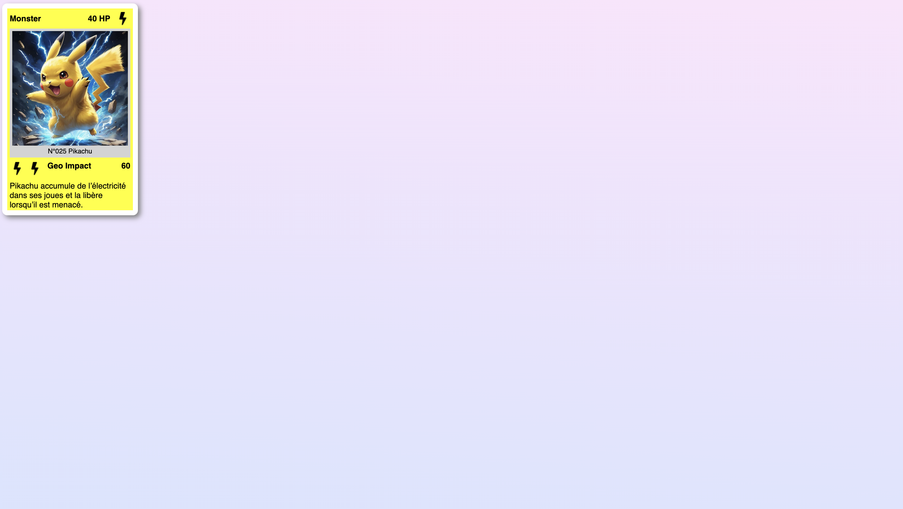

# PlayingCards

This project was generated using [Angular CLI](https://github.com/angular/angular-cli) version 19.1.5.

## Development server

To start a local development server, run:

```bash
ng serve
```

Once the server is running, open your browser and navigate to `http://localhost:4200/`. The application will automatically reload whenever you modify any of the source files.

## Code scaffolding

Angular CLI includes powerful code scaffolding tools. To generate a new component, run:

```bash
ng generate component component-name
```

For a complete list of available schematics (such as `components`, `directives`, or `pipes`), run:

```bash
ng generate --help
```

## Building

To build the project run:

```bash
ng build
```

This will compile your project and store the build artifacts in the `dist/` directory. By default, the production build optimizes your application for performance and speed.

## Running unit tests

To execute unit tests with the [Karma](https://karma-runner.github.io) test runner, use the following command:

```bash
ng test
```

## Running end-to-end tests

For end-to-end (e2e) testing, run:

```bash
ng e2e
```

Angular CLI does not come with an end-to-end testing framework by default. You can choose one that suits your needs.

## Additional Resources

For more information on using the Angular CLI, including detailed command references, visit the [Angular CLI Overview and Command Reference](https://angular.dev/tools/cli) page.

## Notes:

### Après premier commit:
Pour ce premier commit:

- J'ai pu explorer les premières bases de création de projet Web Angular, avec tous les commandes nécessaires pour l'installation des packages nécessaires, la création du projets, le lancement du server, et la géneration du composant.

- J'ai pu explorer la structure du projet avec les differents fichiers qu'il contient:

1. **app.component.ts**

 - **`@Component`**: Le décorateur.
 - **`selector: 'app-playing-cards'`** : `app-playing-cards` est le nom utilisé pour insérer ce composant dans un template **HTML**.
 - **`imports: []`** : Liste des modules à importer et elle est optionnel.
 - **`templateUrl: './playing-cards.component.html'`** : Lien vers le fichier **HTML** qui définit le contenu du composant.
 - **`styleUrl: './playing-cards.component.css'`** : Lien vers le ichier **CSS** qui définit le style du composant.
 - **`export class PlayingCardsComponent {}`** : Permet de créer une classe TypeScript et elle  représente la logique du composant (données, méthodes...)

2. Puis j'ai ajouté dans le fichier `app.component.html` l'élement `<app-playing-cards/>`, pour que ça puisse afficher le contenu défini dans `playing-cards.component.html`

3. Et pui j'ai executé la commande suivante:
```bash
ng g c components/playing-card
```
Et qui m'a permit de génerer mon composant qui contient 4 fichiers:

 - `playing-cards.component.css`: Fichier **CSS** contenant les régles de styles de notre composant.
 - `playing-cards.component.html`: Fichier **HTML** contenant le code **HTML** donc les ressources (texte, images, ...) de notre composant.
 - `playing-cards.component.spec.ts` : Fichier **TypeScript** contenant les tests unitaires de notre composant.
 - `playing-cards.component.ts` : Fichier **TypeScript** permet de lié le fichier **HTML** `playing-cards.component.html` et le fichier **CSS** `playing-cards.component.css` et contient la logique du composant (variables, méthodes, évenements).


4. Et puis j'ai ajouter le code **HTML** souhaité pour ce composant dans le fichier `playing-cards.component.html`

#### Rendu Visuel du projet:

